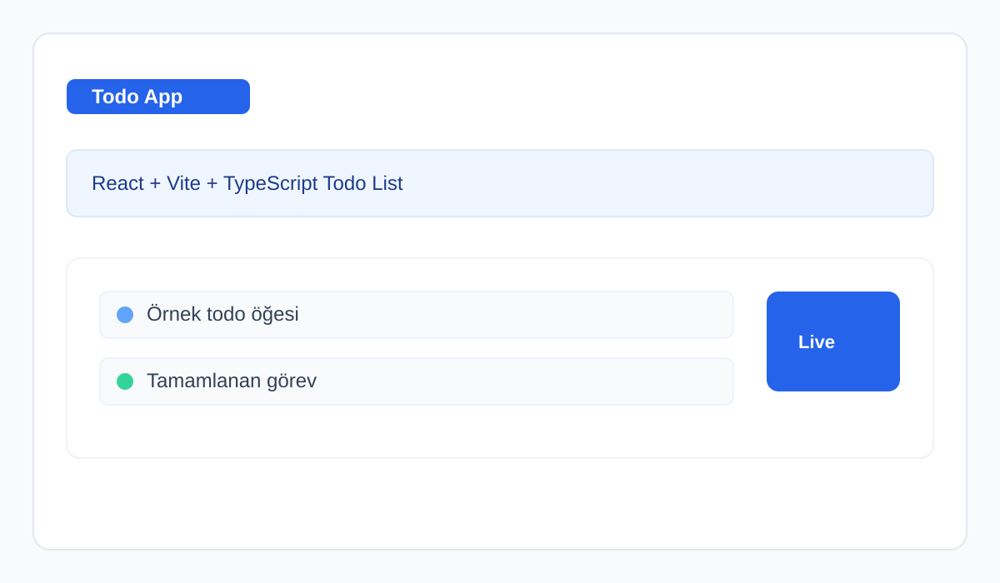
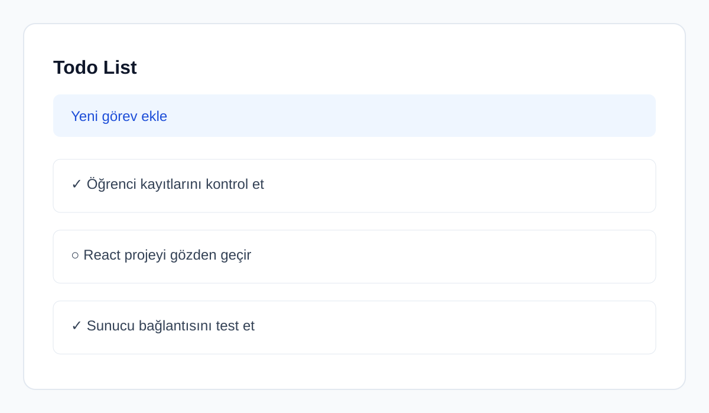

# Web Geliştirme JS Örneği

Bu proje, React, Vite ve TypeScript kullanılarak geliştirilmiş bir todo list uygulamasıdır. Frontend tarafı Vite ile çalışırken, backend tarafı Express tabanlı bir proxy sunucusu üzerinden veri sağlar.

## Proje Adı
Web Geliştirme JS Örneği

## Kısa Açıklama
Bu uygulama, kullanıcıların todo öğelerini listeleyebildiği, basit ve modern bir web arayüzü sunar. Proje hem geliştirme ortamında hızlı bir şekilde çalıştırılabilir hem de build edilerek dağıtım için hazır hale getirilebilir.

## Kullanılan Teknolojiler
- React 19.2.0
- Vite 7.2.4
- TypeScript 5.9.3
- Express 5.2.1
- Flutter sürümü: Bu proje Flutter değil; React/Vite tabanlı bir web uygulamasıdır.

## Çalıştırma Adımları

### 1) Bağımlılıkları yükleyin
```bash
npm install
cd server
npm install
cd ..
```

### 2) Frontend sunucusunu başlatın
```bash
npm run dev
```

### 3) Backend sunucusunu başlatın
Yeni bir terminal açın:
```bash
cd server
node index.js
```

### 4) Uygulamayı görüntüleyin
Tarayıcınızda aşağıdaki adrese gidin:
```text
http://localhost:5173
```

## Ekran Görüntüleri





## Build
```bash
npm run build
```
